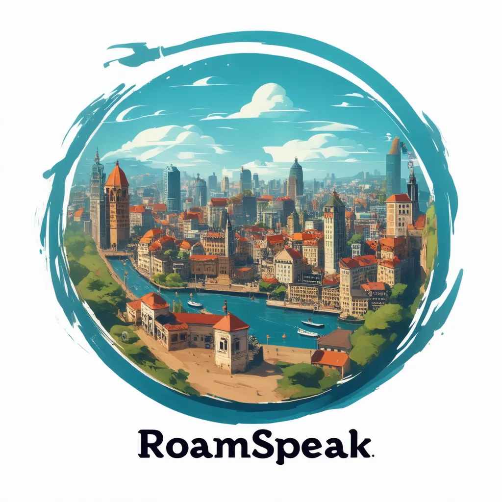

# 🌍 RoamSpeak: AI-Powered Language Learning Game

<div align="center">

</div>

## 🏆 Overview
RoamSpeak is an **AI-driven, immersive language learning game** that places players in a virtual city where they must interact with NPCs, complete real-world tasks, and progress from a **tourist** to a **local resident** while naturally acquiring a new language.

## 🎯 Key Features
✅ **Adaptive AI Dialogues** – NPCs adjust their speech based on player skill level.
✅ **Real-Life Scenarios** – Order at a café, ask for directions, and navigate daily life.
✅ **Speech Recognition** – Practice speaking with voice input and get real-time feedback.
✅ **Progression System** – Advance from **Tourist** → **Short-Term Resident** → **Long-Term Resident**.
✅ **Gamified Learning** – Earn XP, unlock new locations, and track progress.

## 🛠️ Tech Stack
| Component  | Tool |
|------------|----------------|
| 🎮 Game Engine | Godot / Three.js |
| 💻 Frontend | React + Next.js |
| 🚀 Backend | FastAPI (Python) |
| 🗂️ Database | Supabase (PostgreSQL) |
| 🤖 AI Models | Mistral-7B / Llama-2 + Whisper (Speech-to-Text) |
| 🏗️ Hosting | GitHub Pages (frontend), Railway.app (backend) |

## 🚀 Getting Started
### 1️⃣ Clone the Repository
```bash
git clone https://github.com/yourusername/RoamSpeak.git
cd RoamSpeak
```

### 2️⃣ Install Dependencies
```bash
pip install -r backend/requirements.txt
npm install --prefix frontend
```

### 3️⃣ Run the Game Locally
**Start Backend:**
```bash
cd backend
uvicorn main:app --reload
```
**Start Frontend:**
```bash
cd frontend
npm run dev
```

### 4️⃣ Open the Game
Go to **http://localhost:3000** in your browser. 🎮

## 🌱 Contributing
We welcome contributions! To contribute:
1. Fork the repo & create a new branch.
2. Make your changes and commit with clear messages.
3. Submit a pull request for review.

## 📜 License
RoamSpeak is open-source under the MIT License.

---
💡 **Join the community & help shape the future of AI-powered language learning!** 🚀
